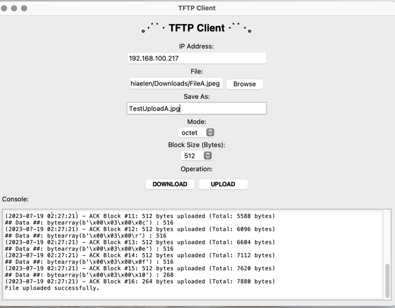

## Project Specifications:

This project aims to demonstrate an understanding and implementation of network protocols, specifically the Trivial File Transfer Protocol (TFTP). The TFTP client program needs to comply with the TFTP protocol specifications, allowing users to upload and download binary files. It should support a GUI or command line interface, allow users to specify the server IP address, and handle errors like unresponsive server, duplicate ACKs, file not found, access violation, and disk full errors. Additional features, such as option negotiation for transfer block size and communicating transfer size to the server, are encouraged but not mandatory. 

## Features Implemented
The program is written in Python and implemented with a fully functioning GUI (Graphical User Interface) to provide a user-friendly interface for interacting with the TFTP protocol. It fully follows the specifications outlined in RFC 1350, with a partial implementation of features introduced in RFCs 2347, 2348, and 2349.

## Directory
1. [Set-Up](https://github.com/MatsTill/TFTP-Client/tree/main/TFTP%20Client%20MP/Set-Up)
   - Program Instructions
   - Compatible TFTP Servers for MacOS & Windows
3. [Deliverables](https://github.com/MatsTill/TFTP-Client/tree/main/TFTP%20Client%20MP/Deliverables)
   - Wireshark Captures
   - Documentation
   - Source Code
5. [References](https://github.com/MatsTill/TFTP-Client/tree/main/TFTP%20Client%20MP/References)
   - RFCs

## Contributors
[Sophia Elen Perez](https://github.com/MatsTill) 
[Brandon Jaramillo](https://github.com/BrandonKYH)
