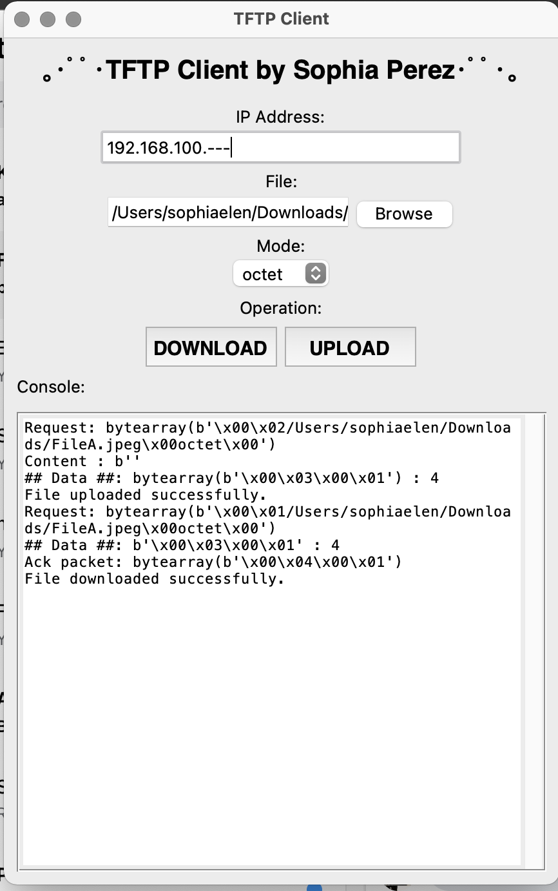

# TFTP-Client
This client program has been developed as part of the requirements for the completion of NSCOM01.

##
Project Specifications:

This project aims to demonstrate an understanding and implementation of network protocols, specifically the Trivial File Transfer Protocol (TFTP). The TFTP client program needs to comply with the TFTP protocol specifications, allowing users to upload and download binary files. It should support a GUI or command line interface, allow users to specify the server IP address, and handle errors like unresponsive server, duplicate ACKs, file not found, access violation, and disk full errors. Additional features, such as option negotiation for transfer block size and communicating transfer size to the server, are encouraged but not mandatory. 

##

## Follow the steps below to set-up the TFTP client:
1.

## Contributors
[Sophia Elen Perez](https://github.com/MatsTill) 

